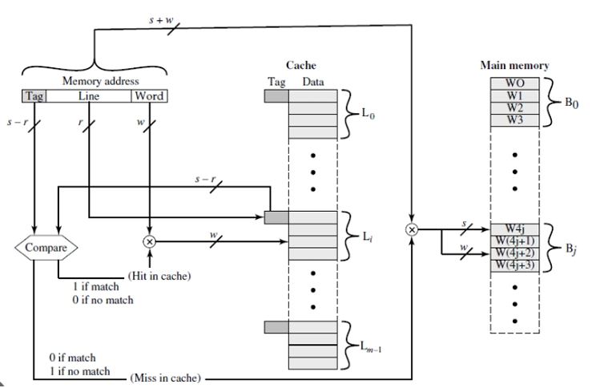

# Digital-Systems-Design-Project-3
Este repositorio contiene el tercer proyecto del curso Diseño de Sistemas Digitales, el cual consiste en la implementación de un sistema de jerarquía de memoria. El proyecto aborda la construcción y simulación de la interacción entre una memoria principal y una memoria caché, con el objetivo de optimizar el acceso a los datos y mejorar el rendimiento del sistema.




## Integrantes del Proyecto

| Nombre Completo              | Carné |
|------------------------------|--------|
| Espinoza Hernández Melanie   |        |
| López Méndez Abner           |        |
| Salas Alvarado Aaron         |        |
| Villalta Ramírez Anthony     |        |


## Módulo cache.sv
Este módulo implementa la memoria **caché de mapeo directo** del sistema. Gestiona accesos de lectura y escritura a palabras de 32 bits, mantiene los bits `valid` y `dirty`, detecta condiciones de `hit` y `miss`, y proporciona toda la información necesaria para que una FSM externa maneje las operaciones de reemplazo, write-back y refill desde la memoria principal.

Descricpción General
---
- Mapeo directo (1 línea por índice)
- Tamaño por defecto:
  - `NUM_LINES = 32`
  - `BLOCK_SIZE = 32 B` (256 bits)
- Detección de hit/miss
- Soporte para **Write-Back** mediante `dirty_array`
- Exposición completa de señales para write-back y refill:
  - `need_writeback`
  - `wb_address`
  - `wb_block_data`
  - `refill_block`
  - `refill_done`
- Lectura combinacional de la palabra solicitada
- Escrituras solo en caso de `write hit`

---
Con bloques de 32 bytes, cada línea contiene 8 palabras de 32 bits.

---

### Tabla de Señales

| Señal | Dir | Bits | Descripción |
|-------|-----|------|-------------|
| clk | in | 1 | Reloj |
| rst | in | 1 | Reset de la caché |
| read_en | in | 1 | Solicitud de lectura |
| write_en | in | 1 | Solicitud de escritura |
| address | in | 16 | Dirección por byte |
| write_data | in | 32 | Datos para escritura |
| read_data | out | 32 | Palabra leída desde el bloque |
| hit | out | 1 | Indica coincidencia válida línea-tag |
| miss | out | 1 | Indica acceso incorrecto (read/write sin hit) |
| need_writeback | out | 1 | Indica que debe escribirse el bloque sucio |
| wb_address | out | 16 | Dirección base del bloque a escribir |
| wb_block_data | out | 256 | Bloque completo para write-back |
| refill_block | in | 256 | Bloque traído de la memoria principal |
| refill_done | in | 1 | Indica que el refill debe aplicarse |

---
#### Lectura
Salida combinacional basada en la palabra seleccionada por `word_index`.

#### Escritura (solo si hay hit)
- Actualiza la palabra correspondiente del bloque
- Marca la línea como `dirty`

#### Miss & Write-Back
Si hay miss:
- `need_writeback = 1` si la línea era válida y dirty
- Se exponen dirección y datos del bloque a la FSM

#### Refill
Cuando `refill_done = 1`:
- Se copia el bloque `refill_block` a la línea correspondiente
- Se actualiza `tag`, `valid = 1` y `dirty = 0`

---

```systemverilog

module cache #(
    parameter NUM_LINES = 32,
    parameter BLOCK_SIZE = 32
)(
    input  logic             clk,
    input  logic             rst,
    input  logic             read_en,
    input  logic             write_en,
    input  logic [15:0]      address,
    input  logic [31:0]      write_data,
    output logic [31:0]      read_data,
    output logic             hit,
    output logic             miss,
    output logic             need_writeback,
    output logic [15:0]      wb_address,
    output logic [255:0]     wb_block_data,
    input  logic [255:0]     refill_block,
    input  logic             refill_done // Puerto de control de la FSM
);

    logic [5:0] tag;
    logic [4:0] index;
    logic [2:0] word_index;

    assign tag        = address[15:10];
    assign index      = address[9:5];
    assign word_index = address[4:2];

    logic             valid_array [0:NUM_LINES-1];
    logic             dirty_array [0:NUM_LINES-1];
    logic [5:0]       tag_array   [0:NUM_LINES-1];
    logic [255:0]     data_array  [0:NUM_LINES-1];

    assign hit  = valid_array[index] && (tag_array[index] == tag);
    assign miss = (read_en || write_en) && !hit;

    always_comb begin
        read_data = data_array[index][word_index*32 +: 32];
    end

    always_ff @(posedge clk or posedge rst) begin
        integer ii;
        if (rst) begin
            // ... (reset logic)
            for (ii = 0; ii < NUM_LINES; ii = ii + 1) begin
                valid_array[ii] <= 0;
                dirty_array[ii] <= 0;
                tag_array[ii]   <= '0;
                data_array[ii]  <= '0;
            end
        end else begin

            // WRITE HIT
            if (hit && write_en) begin
                dirty_array[index] <= 1;
                data_array[index][word_index*32 +: 32] <= write_data;
            end

            // REFILL (Controlado por FSM)
            if (refill_done) begin
                data_array[index]  <= refill_block;
                tag_array[index]   <= tag;
                valid_array[index] <= 1;
                dirty_array[index] <= 0;
            end
        end
    end

    assign need_writeback = miss && valid_array[index] && dirty_array[index];
    assign wb_block_data = data_array[index];
    assign wb_address = {tag_array[index], index, 5'b00000};

endmodule
```
## Módulo main_memory_bram.sv

### Descripción General
Este módulo implementa la memoria principal del sistema, organizada como una matriz de 2048 bloques de 256 bits cada uno, para un total de 65 536 bytes (65 KiB).  
La memoria está organizada por bloques para soportar operaciones de write-back y refill provenientes de la caché, además de ofrecer accesos síncronos tanto a palabras (32 bits) como a bloques completos (256 bits).

El diseño representa una memoria tipo BRAM con todas las operaciones controladas en flanco positivo de reloj.

---

### Características Principales
- Capacidad total: 65 KiB distribuidos en 2048 bloques de 256 bits.
- Acceso síncrono a:
  - Palabras de 32 bits.
  - Bloques completos de 256 bits.
- Soporte para:
  - Escrituras de palabra (word write).
  - Escrituras completas de bloque (write-back desde la caché).
  - Lecturas de palabra.
  - Lecturas de bloque (refill hacia la caché).
- Inicialización mediante bloque `initial`.
- Dirección por byte, adecuadamente decodificada en índices de bloque y palabra.

---

### Organización de la Dirección
Para lecturas y escrituras de bloque se utilizan direcciones base alineadas a 32 bytes (`block_addr_rd`, `block_addr_wr`), y para accesos a palabra se usan direcciones por byte (`byte_addr`, `byte_addr_rd`).

---

### Tabla de Señales

| Señal | Dir | Bits | Descripción |
|-------|-----|------|-------------|
| clk | in | 1 | Reloj |
| reset | in | 1 | Reset síncrono |
| write_en_word | in | 1 | Habilita escritura de palabra |
| byte_addr | in | 16 | Dirección de la palabra a escribir |
| write_word | in | 32 | Datos de la palabra |
| write_en_block | in | 1 | Habilita escritura de bloque completo |
| block_addr_wr | in | 16 | Dirección base del bloque a escribir |
| write_block | in | 256 | Datos completos del bloque |
| read_block_en | in | 1 | Habilita lectura de bloque |
| block_addr_rd | in | 16 | Dirección base del bloque a leer |
| read_block_out | out | 256 | Datos del bloque leído |
| read_word_en | in | 1 | Habilita lectura de palabra |
| byte_addr_rd | in | 16 | Dirección de la palabra a leer |
| read_word_out | out | 32 | Palabra leída |

---

### Comportamiento Interno
1. Las operaciones de lectura y escritura son completamente síncronas.
2. Se diferencian dos tipos de escritura:
   - Escritura de bloque completo (256 bits) empleada en write-back.
   - Escritura de palabra (32 bits) dentro de un bloque.
3. Las lecturas de bloque y palabra generan registros internos de salida.
4. La memoria se inicializa a cero, y luego se cargan patrones especiales en:
   - Bloque 0: valores 0x10000000 + w
   - Bloque 1024: valores 0x20000000 + w

```systemverilog
// Memoria organizada en bloques de 256 bits (32 bytes).
// 2048 bloques * 32 bytes = 65536 bytes total.

module main_memory_bram(
    input  logic        clk,
    input  logic        reset,

    // write word (synchronous) - para writes de 32-bit dentro de un bloque
    input  logic        write_en_word,
    input  logic [15:0] byte_addr,      
    input  logic [31:0] write_word,

    // write block (synchronous) - writeback de 256-bit
    input  logic        write_en_block,
    input  logic [15:0] block_addr_wr,  
    input  logic [255:0] write_block,

    // read block (synchronous)
    input  logic        read_block_en,
    input  logic [15:0] block_addr_rd,  
    output logic [255:0] read_block_out,

    // read word (synchronous)
    input  logic        read_word_en,
    input  logic [15:0] byte_addr_rd,
    output logic [31:0] read_word_out
);

    // 2048 bloques de 256 bits
    logic [255:0] mem_block [0:2047];

    // registros de salida (síncronos)
    logic [255:0] read_block_reg;
    logic [31:0]  read_word_reg;

    assign read_block_out = read_block_reg;
    assign read_word_out  = read_word_reg;

    // indices
    logic [10:0] block_idx_wr;
    logic [10:0] block_idx_rd;
    logic [10:0] block_idx_word_wr;
    logic [10:0] block_idx_word_rd;
    logic [2:0]  word_idx_wr;
    logic [2:0]  word_idx_rd;

    assign block_idx_wr = block_addr_wr[15:5];
    assign block_idx_rd = block_addr_rd[15:5];
    assign block_idx_word_wr = byte_addr[15:5];
    assign block_idx_word_rd = byte_addr_rd[15:5];

    assign word_idx_wr = byte_addr[4:2];
    assign word_idx_rd = byte_addr_rd[4:2];

    // Synchronous memory operations
    always_ff @(posedge clk) begin
        if (reset) begin
            read_block_reg <= '0;
            read_word_reg  <= '0;
            
        end else begin
            // block write (writeback)
            if (write_en_block) begin
                mem_block[block_idx_wr] <= write_block;
            end

            // word write 
            if (write_en_word) begin
                mem_block[block_idx_word_wr][word_idx_wr*32 +: 32] <= write_word;
            end

            // synchronous block read
            if (read_block_en) begin
                read_block_reg <= mem_block[block_idx_rd];
            end

            // synchronous word read
            if (read_word_en) begin
                read_word_reg <= mem_block[block_idx_word_rd][word_idx_rd*32 +: 32];
            end
        end
    end


    initial begin
        integer blk, w;
        logic [31:0] words [0:7];
        logic [255:0] built_block;

        // Inicializar toda la memoria a cero
        for (blk = 0; blk < 2048; blk = blk + 1) begin
            for (w = 0; w < 8; w = w + 1) begin
                words[w] = 32'h0;
            end
            built_block = {words[7], words[6], words[5], words[4],
                           words[3], words[2], words[1], words[0]};
            mem_block[blk] = built_block;
        end

        // BLOQUE 0: patrón 0x1000_0000 + w
        for (w = 0; w < 8; w = w + 1) words[w] = 32'h1000_0000 + w;
        built_block = {words[7], words[6], words[5], words[4],
                       words[3], words[2], words[1], words[0]};
        mem_block[0] = built_block;

        // BLOQUE 1024: patrón 0x2000_0000 + w
        for (w = 0; w < 8; w = w + 1) words[w] = 32'h2000_0000 + w;
        built_block = {words[7], words[6], words[5], words[4],
                       words[3], words[2], words[1], words[0]};
        mem_block[1024] = built_block;

    end

endmodule
```

## Módulo memory_hierarchy.sv

### Descripción General
Este módulo integra la caché y la memoria principal en un sistema jerárquico completo. Implementa:

1. La caché de mapeo directo.
2. La memoria principal basada en bloques de 256 bits.
3. Una máquina de estados (FSM) encargada de manejar:
   - Misses de caché.
   - Operaciones de write-back cuando el bloque reemplazado está sucio.
   - Solicitud de bloques a memoria principal (refill).
   - Coordinación de lecturas, escrituras y control de señales de ambas memorias.

El módulo expone una interfaz simple tipo procesador: `read_en`, `write_en`, `address`, `write_data`, `read_data`, y una señal `hit`.

---

### Responsabilidades del Módulo
- Detectar misses provenientes del módulo `cache`.
- Determinar si el bloque debe ser escrito (write-back).
- Solicitar lectura de bloque a memoria principal.
- Indicar a la caché cuándo aplicar el refill (`refill_done`).
- Coordinar prioridades entre:
  - Escritura de bloque (write-back)
  - Lectura de bloque (refill)
- Asegurar que solo una operación de memoria ocurra por ciclo.

---

### Máquina de Estados (FSM)

La FSM controla todo el flujo de miss, write-back y refill.  
Estados:
Transiciones principales:
- Si hay miss limpio → REFILL_REQ.
- Si hay miss sucio → WRITEBACK → REFILL_REQ.
- Después de REFILL_REQ → REFILL_WAIT.
- Después de REFILL_WAIT → IDLE.

Señal clave:
Esta señal activa el refill dentro de la caché.

---

### Señales Internas Importantes

| Señal | Descripción |
|-------|-------------|
| miss_reg | Registra el miss para evitar perderlo durante la transición de estados |
| need_wb | Indica si la línea expulsa un bloque sucio |
| wb_addr | Dirección base del bloque a escribir en memoria |
| wb_data | Bloque completo a escribir |
| mem_write_en_block | Escritura de bloque (256 bits) en main memory |
| mem_read_block_en | Lectura de bloque desde main memory |
| refill_done | Indica a la caché que debe cargar el bloque leído |

---

### Flujo Completo de Miss y Refill

1. Procesador solicita acceso.
2. La caché reporta `hit` o `miss`.
3. Si es `miss`:
   - Si `need_wb = 1`, se escribe el bloque sucio en memoria.
   - Luego se solicita el bloque que contiene la dirección pedida.
4. La memoria entrega el bloque y la FSM asserta `refill_done`.
5. La caché carga el bloque, actualiza tag/valid/dirty.
6. El sistema vuelve a `IDLE`.

```systemverilog

module memory_hierarchy(
    input  logic clk,
    input  logic reset,
    input  logic read_en,
    input  logic write_en,
    input  logic [15:0] address,
    input  logic [31:0] write_data,
    output logic [31:0] read_data,
    output logic hit
);
    
    // Señales internas
    logic miss, need_wb;

    logic [15:0]  wb_addr;
    logic [255:0] wb_data;

    // Control
    logic miss_reg; 
    logic refill_done;
    
    // Señales de Memoria
    logic mem_write_en_word, mem_write_en_block, mem_read_block_en, mem_read_word_en;
    logic [15:0] mem_byte_addr_word, mem_block_addr_wr, mem_block_addr_rd, mem_byte_addr_rd;
    logic [31:0] mem_write_word, mem_read_word_out;
    logic [255:0] mem_write_block, mem_read_block_out;
    
    // ---------------------------------------------------------
    // 1. Instancia de CACHE 
    // ---------------------------------------------------------
    cache CACHE(
        .clk(clk), .rst(reset),
        .read_en(read_en), .write_en(write_en),
        .address(address), .write_data(write_data),
        .read_data(read_data), .hit(hit), .miss(miss),
        .need_writeback(need_wb), .wb_address(wb_addr),
        .wb_block_data(wb_data), 
        
        .refill_block(mem_read_block_out), // Conexión Directa
        
        .refill_done(refill_done)
    );

    // 2. Instancia de MEMORIA
    main_memory_bram MEM(
        .clk(clk), .reset(reset),
        .write_en_word(mem_write_en_word),
        .byte_addr(mem_byte_addr_word),
        .write_word(mem_write_word),
        .write_en_block(mem_write_en_block),
        .block_addr_wr(mem_block_addr_wr),
        .write_block(mem_write_block),
        .read_block_en(mem_read_block_en),
        .block_addr_rd(mem_block_addr_rd),
        .read_block_out(mem_read_block_out),
        .read_word_en(mem_read_word_en),
        .byte_addr_rd(mem_byte_addr_rd),
        .read_word_out(mem_read_word_out)
    );

    // 3. FSM
    typedef enum logic [1:0] {
        IDLE        = 2'b00,
        WRITEBACK   = 2'b01,
        REFILL_REQ  = 2'b10,
        REFILL_WAIT = 2'b11
    } state_t;

    state_t state, next_state;

    always_ff @(posedge clk or posedge reset) begin
        if (reset) state <= IDLE;
        else state <= next_state;
    end

    // Registro del Miss 
    always_ff @(posedge clk or posedge reset) begin
        if (reset) 
            miss_reg <= 0;
        else 
            if (state == IDLE) 
                miss_reg <= (read_en || write_en) ? miss : 0; 
            else
                miss_reg <= 0;
    end
    
    always_comb begin
        next_state = state;
        case (state)
            IDLE: begin
                if (miss_reg) begin
                    if (need_wb) next_state = WRITEBACK;
                    else next_state = REFILL_REQ;
                end
            end
            WRITEBACK:   next_state = REFILL_REQ;
            REFILL_REQ:  next_state = REFILL_WAIT;
            REFILL_WAIT: next_state = IDLE;
            default:     next_state = IDLE;
        endcase
    end

    assign refill_done = (state == REFILL_WAIT) && (next_state == IDLE);
    
    // 4. Salidas 
    always_ff @(posedge clk or posedge reset) begin
        if (reset) begin
            mem_write_en_word  <= 0; mem_byte_addr_word <= 0; mem_write_word <= 0;
            mem_write_en_block <= 0; mem_block_addr_wr  <= 0; mem_write_block <= 0;
            mem_read_block_en  <= 0; mem_block_addr_rd  <= 0;
            mem_read_word_en   <= 0; mem_byte_addr_rd   <= 0;
        end else begin
            // Defaults
            mem_write_en_word  <= 0; mem_write_en_block <= 0;
            mem_read_block_en  <= 0; mem_read_word_en   <= 0;
            
            case (state)
                WRITEBACK: begin
                    mem_write_en_block <= 1;
                    mem_block_addr_wr  <= wb_addr; 
                    mem_write_block    <= wb_data;
                end

                REFILL_REQ: begin
                    mem_block_addr_rd <= {address[15:5], 5'b0};
                    mem_read_block_en <= 1;
                end

                REFILL_WAIT: begin
                    // La caché lo toma directo de mem_read_block_out gracias al wire.
                end

                default: begin end
            endcase
        end
    end

endmodule
```

## Módulo processor.sv

### Descripción General
Este módulo implementa un procesador simple utilizado únicamente para propósitos de simulación dentro del proyecto. Su función es generar una secuencia de accesos de lectura y escritura hacia la jerarquía de memoria, con el objetivo de verificar el comportamiento del sistema completo: caché, FSM y memoria principal.

El módulo no implementa un procesador real; únicamente genera señales controladas por un contador de ciclos para ejecutar un conjunto predeterminado de operaciones que permiten observar hits, misses, write-back y refill.

---

### Características Principales
- Contador de ciclos de 32 bits que avanza en cada flanco positivo de reloj.
- Generación determinística de operaciones de lectura y escritura.
- Permite validar:
  - Miss inicial.
  - Hit posterior dentro del mismo bloque.
  - Escritura dentro de un bloque ya cargado (dirty bit).
  - Evicción de bloque sucio.
  - Refill de bloque desde memoria principal.

---

### Secuencia de Operaciones

La siguiente tabla resume las operaciones generadas:

| Ciclo | Operación | Dirección | Descripción |
|-------|-----------|-----------|-------------|
| 2     | Read      | 0x0004    | Primera lectura, produce miss y refill |
| 4     | Read      | 0x0008    | Hit dentro del mismo bloque |
| 6     | Write     | 0x0004    | Escritura, marca dirty bit |
| 8     | Read      | 0x0004    | Lectura del dato escrito (DEADBEEF) |
| 10    | Read      | 0x8004    | Acceso a otro bloque, fuerza sustitución y write-back |

Estas operaciones son suficientes para demostrar el funcionamiento correcto de toda la jerarquía.

---

### Señales Expuestas

| Señal | Dir | Bits | Descripción |
|-------|------|-------|-------------|
| clk | in | 1 | Reloj |
| reset | in | 1 | Inicializa el contador y las señales |
| read_en | out | 1 | Señal de lectura hacia la jerarquía de memoria |
| write_en | out | 1 | Señal de escritura |
| address | out | 16 | Dirección de acceso |
| write_data | out | 32 | Palabra de escritura |

---

```systemverilog
module processor(
    input  logic clk,
    input  logic reset,
    output logic read_en,
    output logic write_en,
    output logic [15:0] address,
    output logic [31:0] write_data
);

    logic [31:0] cycle;  // Contador de ciclos

    always_ff @(posedge clk or posedge reset) begin
        if (reset)
            cycle <= 0;
        else
            cycle <= cycle + 1;
    end

    always_ff @(posedge clk or posedge reset) begin
        if(reset) begin
            read_en    <= 0;
            write_en   <= 0;
            address    <= 0;
            write_data <= 32'h0;
        end else begin
            
            read_en  <= 0;
            write_en <= 0;
            
            case (cycle)
                2: begin  
                    read_en  <= 1;  
                    address  <= 16'h0004;  
                end
                4: begin  
                    read_en  <= 1;  
                    address  <= 16'h0008;  
                end
                6: begin  
                    write_en   <= 1;  
                    address    <= 16'h0004;  
                    write_data <= 32'hDEADBEEF;  
                end
                8: begin  
                    read_en  <= 1;  
                    address  <= 16'h0004;  
                end
                10: begin  
                    read_en  <= 1;  
                    address  <= 16'h8004;  
                end
                default: begin
                    // read_en y write_en ya son 0.
                end
            endcase
        end
    end

endmodule
```
## Módulo `top.sv`

### Descripción General
El módulo `top` integra todos los componentes principales del sistema de jerarquía de memoria:

1. El módulo `processor`, que genera solicitudes de lectura y escritura.
2. El módulo `memory_hierarchy`, que implementa la caché, la memoria principal y la FSM de manejo de misses.
3. Señales de depuración (`dbg_address`, `dbg_hit`, `dbg_read_data`) que permiten observar el comportamiento interno durante la simulación.

Este módulo actúa como el punto de entrada del sistema completo y es el que se instancia dentro del testbench.

---

### Arquitectura del Módulo

El procesador envía:
- read_en, write_en
- address
- write_data

La jerarquía devuelve:
- read_data
- hit

El módulo expone estas señales de salida para depuración.

---

### Señales de Depuración

| Señal | Bits | Descripción |
|-------|-------:|-------------|
| dbg_address | 16 | Última dirección solicitada por el procesador |
| dbg_hit | 1 | Indica si la operación generó hit en caché |
| dbg_read_data | 32 | Resultado leído (cuando `read_en = 1`) |

Estas señales permiten imprimir en el testbench información útil para evaluar el sistema.

---

```systemverilog
module top(
    input  logic clk,
    input  logic reset,
    output logic [15:0] dbg_address,
    output logic        dbg_hit,
    output logic [31:0] dbg_read_data
);

    logic read_en, write_en;
    logic [15:0] address;
    logic [31:0] write_data;
    logic [31:0] read_data;
    logic hit;

    processor CPU(
        .clk(clk),
        .reset(reset),
        .read_en(read_en),
        .write_en(write_en),
        .address(address),
        .write_data(write_data)
    );

    memory_hierarchy MH(
        .clk(clk),
        .reset(reset),
        .read_en(read_en),
        .write_en(write_en),
        .address(address),
        .write_data(write_data),
        .read_data(read_data),
        .hit(hit)
    );

    assign dbg_address   = address;
    assign dbg_hit       = hit;
    assign dbg_read_data = read_data;

endmodule

```

